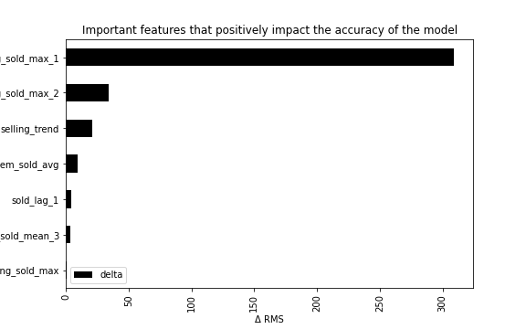
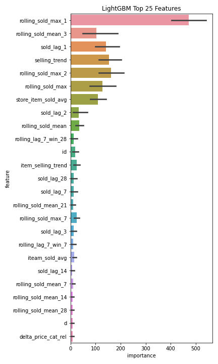

## Machine Learning for Retail Sales Forecasting — Permutation Feature Importance 📉
*Understand the impacts on a model perforamnce if we artificially remove a feature from a pre-trained model*

### Problem Statement
In the previous repository we have built an improved version of our model using additional features that impact the sales quantity. Based on the features importance plot, we know that some features have less impact on the performance of our model than others. However, can we estimate what would be the impact if we remove these non-essential features without having to re-train our model?

### Permutation Feature Importance 
The **permutation feature importance** is defined to be the decrease in a model score when a single feature value is randomly shuffled. The idea is to test the impact on the accuracy score (RMSE on validation set) if a feature is not available. We will then perform a random shuffle for each of the feature on the validation and test the results:
1. We measure the baseline (i.e the performance of the model with all features): baseline_rmse
2. We perform the random shuffle for each of the feature and compute the new rmse: new_rmse
  - If new_rmse << baseline_rmse: we'd better remove this feature from the training set
  - If new_rmse == baseline_rmse: this feature is neutral
  - If new_rmse >> baseline_rmse: this feature is capital to ensure good performance of the model

You can find the origin of this "noising" method in this paper by Breiman, “Random Forests”, Machine Learning, 2001 [Paper](
https://www.stat.berkeley.edu/~breiman/randomforest2001.pdf)

## Code
_In order to run this notebook you need the data generated by the previous repo: [Machine Learning for Retail Sales Forecasting — Features Engineering 📈](https://github.com/samirsaci/ml-forecast-features-eng#machine-learning-for-retail-sales-forecasting--features-engineering-)_

### Prepare your environment
**1. Clone the repository in your local directory and install a local environment** 

### Install **virtualenv** using pip3

    sudo pip3 install virtualenv 

### Now create a virtual environment 

    virtualenv venv 
  
### Active your virtual environment    
    
    source venv/bin/activate

### Install all dependencies needed using requirements.txt

     pip install -r requirements.txt 
**2. Put the DataFrame created using the notebook of the previous repo 'data_features_improved.pkl' in the folder /data**
**3. Copy the pickle files that include the stores names, categories, ... in the folder data/params**

### Launch Calculations
**4. Launch the notebook**

> If you consider the full scope of the analysis most of your features are neutral and some of them are key to build your model. However, if you filter the scope taking only 1 category, you'll be surprised to see which features are negatively impacting the accuracy depending on which family you take.

### Think beyond

  

_**Noising Method:** These features are considered as the most important in the model (highest negative impact on the accuracy if you remove them)_

  

_Features importance plot_

> How can we explain that that some features are not considered as very important by the noising method and we can find them among the most important in the features importance plot?

## About me 🤓
Senior Supply Chain Engineer with an international experience working on Logistics and Transportation operations. \
Have a look at my portfolio: [Data Science for Supply Chain Portfolio](https://samirsaci.com) \
Data Science for Warehousing📦, Transportation 🚚 and Demand Forecasting 📈 

